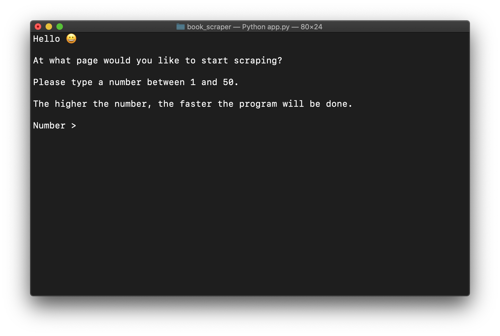
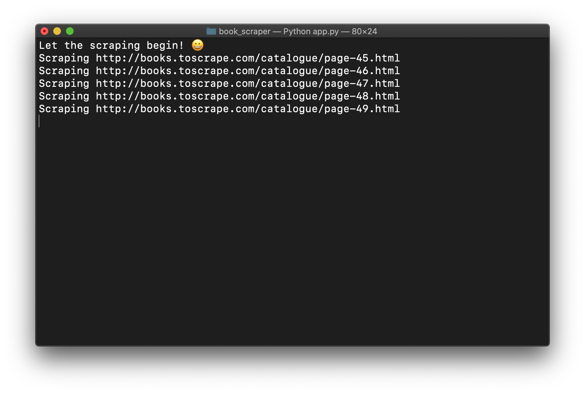
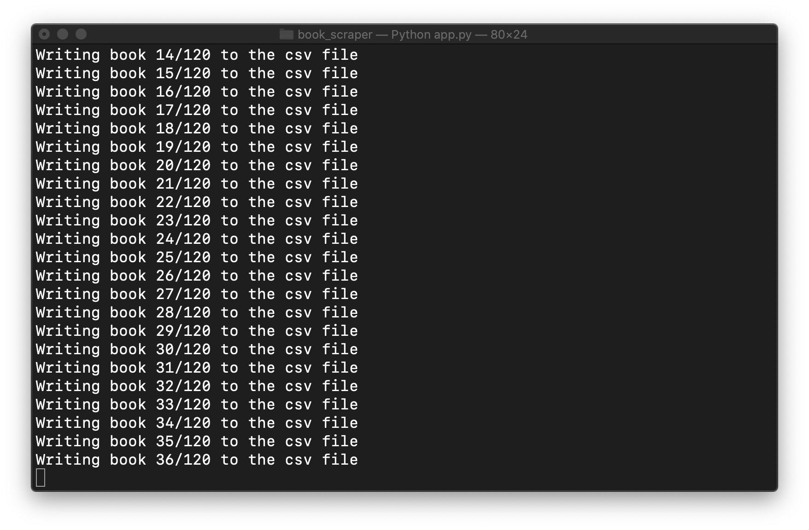
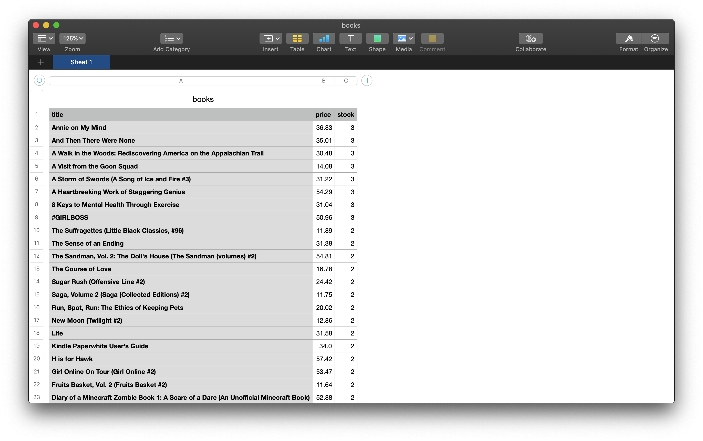

<h1>Book Scraper</h1>

<h2>Table of Contents</h2>
<ol>
  <li><a href="#description">Description</a></li>
  <li><a href="#installation">Installation</a></li>
</ol>

<h2 id="description">1. Description</h2>
<p>This program scrapes books from a <a href="http://books.toscrape.com">website</a>, writes it to a CSV file, and inserts it into a database for further analysis.</p>

<table>
  <tr>
    <th>Start</th>
    <th>Web Scraping</th>
  </tr>
  <tr>
    <td></td>
    <td></td>
  </tr>
  <tr>
    <th>Writing to CSV File</th>
    <th>Results</th>
  </tr>
  <tr>
    <td></td>
    <td></td>
  </tr>
</table>

<h2 id="installation">2. Installation</h2>

```
git clone https://github.com/marcusvanwinden/book_scraper.git
cd book_scraper
python3 -m venv venv
source venv/bin/activate
pip3 install -r requirements.txt
python3 app.py
```
